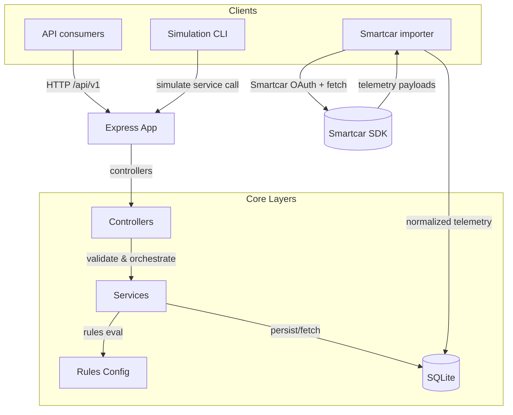

# EV Battery Insight Service

## Overview

This repository hosts a TypeScript + Express service that ingests EV telemetry, evaluates battery health using transparent rules, and returns actionable insights. It is designed for demos and light integrations that need a small, explainable backend rather than a full fleet platform.

### What problem this solves

- Consolidates raw EV telemetry into a single SQLite-backed source of truth for health scoring and alerts.
- Produces human-readable tips for drivers and operators, reducing the effort to interpret SOC trends, idle drain, or rapid drop events.
- Provides deterministic simulations so teams can demo and regress scenarios without live vehicles.

### Smartcar integration (for ingestion + simulation parity)

- Uses Smartcar OAuth to pull real or simulated vehicle telemetry (battery, charge, odometer, location) and normalize it into the internal schema.
- Imported Smartcar snapshots can be processed through the same scoring and alerting pipeline used by the simulation engine, keeping live and simulated data aligned.
- The Smartcar-facing endpoints were removed from the public API surface; Smartcar is now consumed only by internal scripts (e.g., `npm run smartcar:import`) and can be swapped for other providers later.

### Architecture at a glance



## Runtime Requirements

| Tool        | Recommended | Verified locally |
| ----------- | ----------- | ---------------- |
| Node.js     | 20.x LTS    | 25.2.1           |
| npm         | 10.x+       | 11.7.0           |
| sqlite3 CLI | 3.45+       | 3.45.0           |

> Use Node 20 in production environments. Later versions (e.g., 25.x) work for development but are not the target LTS.

## Quickstart

1. Install dependencies: `npm install`.
2. Copy [.env.example](.env.example) to `.env` and customize the values (see Environment Configuration).
3. Apply database migrations: `npm run db:migrate`.
4. Launch the development server: `npm run dev` (watches for changes with hot reload).
5. In a separate terminal, send a telemetry payload (see API Usage) to confirm end-to-end flow.

> Tip: keep the SQLite file under `data/` so migrations and the docker-compose volume share the same location.

## Environment Configuration

All configuration is driven through environment variables loaded via `.env`. Refer to [.env.example](.env.example) for inline documentation.

| Variable | Description | Default | When to adjust |
| -------- | ----------- | ------- | -------------- |
| `PORT` | HTTP port exposed by Express. | `3000` | Change to avoid collisions when running alongside other services. |
| `API_KEY` | Shared secret expected in the `x-api-key` header for every `/api/v1` request. | `demo-api-key` | Replace for non-demo environments to prevent unauthorized access. |
| `DATABASE_PATH` | Filesystem path to the SQLite database. | `./data/battery.sqlite` | Point to an alternate file or `:memory:` during tests. |
| `LOG_LEVEL` | Pino log verbosity. | `info` | Increase to `debug` (local troubleshooting) or decrease to `warn` in production. |
| `SIMULATION_DEFAULT_VEHICLE_ID` | Vehicle identifier used when simulations do not supply one. | `simulated-vehicle` | Provide fleet-specific identifiers for demo accuracy. |
| `RATE_LIMIT_WINDOW_MS` | Duration of the rate-limiter window in milliseconds. | `60000` | Tune for higher/lower request throughput based on deployment needs. |
| `RATE_LIMIT_MAX` | Maximum requests allowed per IP within the window. | `120` | Increase for trusted internal callers or tighten for public-facing deployments. |
| `REQUEST_ID_HEADER` | Correlation ID header propagated through logs and responses. | `x-request-id` | Align with upstream gateways that already stamp request identifiers. |
| `SMARTCAR_CLIENT_ID` | Smartcar application client identifier used during OAuth. | _(required)_ | Copy from the Smartcar dashboard (demo or staging tenant). |
| `SMARTCAR_CLIENT_SECRET` | Smartcar application secret. | _(required)_ | Copy from the Smartcar dashboard; never commit this value. |
| `SMARTCAR_REDIRECT_URI` | OAuth redirect URI accepted by your Smartcar app. | _(required)_ | Use `http://localhost:3000/api/v1/smartcar/callback` for local demos. |
| `SMARTCAR_SCOPES` | Comma-separated Smartcar scopes requested during OAuth. | `read_vehicle_info,read_battery,read_charge,read_odometer,read_location` | Adjust when adding new Smartcar capabilities and re-run Smartcar Connect to grant them. |
| `SMARTCAR_MODE` | Smartcar environment (`test` or `live`). | `test` | Switch to `live` when connecting production vehicles. |
| `SMARTCAR_FORCE_PROMPT` | Forces Smartcar Connect to prompt for approval each visit. | `true` | Set to `false` when reusing existing approvals without user interaction. |

After editing `.env`, restart the server so new values take effect.

## Run Locally (quick guide)

1. `npm install`
2. Copy `.env.example` to `.env` and set `API_KEY` (and Smartcar vars only if you will import via Smartcar).
3. `npm run db:migrate`
4. Start the server: `npm run dev`
5. Send telemetry (see examples below) and fetch insights.
6. Optional: seed data with `npm run simulate -- --scenario=urban --persist`.

## Smartcar import (optional)

Smartcar is used only by the importer script (routes are disabled). If you want to pull Smartcar telemetry for demos:

1. Set `SMARTCAR_CLIENT_ID`, `SMARTCAR_CLIENT_SECRET`, `SMARTCAR_REDIRECT_URI`, `SMARTCAR_SCOPES` in `.env`.
2. Run the server (`npm run dev`) and complete the OAuth flow using `npm run smartcar:import -- --dry-run` (the script guides you through Connect in the browser).
3. Run without `--dry-run` to persist normalized snapshots alongside simulated data.

## API Usage

All API calls require the `x-api-key` header set to the configured `API_KEY`.

### Ingest Telemetry

Endpoint: `POST /api/v1/telemetry`

1. Send a payload (example below) with ISO timestamps and state-of-charge percentages.
2. The response includes score, status band, rule impacts, alerts, tips, and the persisted telemetry snapshot.

```bash
curl -X POST \
  -H "Content-Type: application/json" \
  -H "x-api-key: ${API_KEY}" \
  http://localhost:3000/api/v1/telemetry \
  -d '{
    "vehicleId": "demo-vehicle",
    "timestamp": "2024-01-01T08:00:00.000Z",
    "batteryPercentage": 82,
    "speedKmph": 22,
    "engineOn": true,
    "charging": false
  }'
```

### Retrieve Vehicle Insights

Endpoint: `GET /api/v1/vehicles/{vehicleId}/insights`

- Returns the latest snapshot, recalculated evaluation, active alerts/tips, and recent history from the insights log.
- Responds with `404` if the vehicle has not ingested telemetry yet.

```bash
curl -H "x-api-key: ${API_KEY}" \
  http://localhost:3000/api/v1/vehicles/demo-vehicle/insights
```

### Explore Simulation Scenarios

Endpoints:

- `GET /api/v1/simulate/scenarios` lists the built-in urban, highway, and mixed profiles.
- `POST /api/v1/simulate/drive` executes a scenario, optionally persisting each sample through the ingestion pipeline.

```bash
curl -X POST \
  -H "Content-Type: application/json" \
  -H "x-api-key: ${API_KEY}" \
  http://localhost:3000/api/v1/simulate/drive \
  -d '{ "scenario": "urban", "persist": false }'
```

When `persist` is true, the returned `alerts`, `tips`, and final `score` reflect the same telemetry stored in SQLite.

## Simulation Toolkit

- **API-first demos:** use the simulation endpoints to seed data and immediately query insights, as outlined in [docs/DemoScript.md](docs/DemoScript.md).
- **CLI automation:** invoke `npm run simulate -- --scenario=urban --persist` to populate data without issuing manual HTTP requests.
- **Custom timestamps:** pass `baseTimestamp` in the simulation request to shift the generated drive timeline.

## Smartcar details

- No Smartcar endpoints are exposed on the API. The importer (`npm run smartcar:import`) is the only Smartcar entrypoint and normalizes data into the same pipeline as simulations.
- Use the Smartcar env vars only when running the importer; the core API works with simulations alone.

## Health, Readiness, and Logging

- `GET /health` verifies the process is alive.
- `GET /ready` performs a database connectivity check and reports pending migrations; it responds with `503` until the service is fully ready. Responses include the correlation ID echoed in the `requestId` field.
- Pino logging attaches correlation IDs from the `REQUEST_ID_HEADER` or generates new UUIDs. Sensitive headers (`x-api-key`, `authorization`, `cookie`) are redacted automatically.

## npm Scripts

| Script               | Description                                      |
| -------------------- | ------------------------------------------------ |
| `npm run dev`        | Launch the development server via `ts-node-dev`. |
| `npm run start`      | Run compiled application from `dist/index.js`.   |
| `npm run build`      | Compile TypeScript to `dist/`.                   |
| `npm run db:migrate` | Apply pending SQLite migrations.                 |
| `npm run simulate`   | Run a simulation scenario via `scripts/simulate.ts`. |
| `npm run smartcar:import` | Import Smartcar telemetry (optional).        |

## API Overview

| Method | Path | Description |
| ------ | ---- | ----------- |
| `POST` | `/api/v1/telemetry` | Ingest telemetry, score vehicle health, and persist history. |
| `GET` | `/api/v1/vehicles/{vehicleId}/insights` | Retrieve latest score, alerts, and tips for a vehicle. |
| `GET` | `/api/v1/simulate/scenarios` | List deterministic simulation scenarios. |
| `POST` | `/api/v1/simulate/drive` | Execute a simulated drive; optionally persist telemetry. |
| `GET` | `/health` | Basic liveness probe. |
| `GET` | `/ready` | Readiness probe that verifies SQLite connectivity and migration state. |
| `GET` | `/health` | Basic liveness probe. |
| `GET` | `/ready` | Readiness probe that verifies SQLite connectivity and migration state. |

## Documentation Assets

- Rules and scoring details: [docs/Rules.md](docs/Rules.md)
- Demo walkthrough: [docs/DemoScript.md](docs/DemoScript.md)
- OpenAPI contract: [docs/openapi.yaml](docs/openapi.yaml)
- Postman collection: [docs/postman_collection.json](docs/postman_collection.json)

## Database Operations

The service stores data in a SQLite database located at data/battery.sqlite by default. Adjust the path via the `DATABASE_PATH` environment variable.

- Apply migrations: `npm run db:migrate`
- Reset database (development):
  1. Delete the database file under `data/` (if present).
  2. Re-run migrations with `npm run db:migrate`.

## Operations

- Rate limiting defaults to 120 requests per minute per IP. Tune via `RATE_LIMIT_WINDOW_MS` and `RATE_LIMIT_MAX`.
- Request/response logs include correlation ids sourced from `x-request-id` (configurable) and automatically redact API keys and cookies.
- Health endpoints:
  - `GET /health` returns a minimal liveness payload.
  - `GET /ready` returns readiness details or `503` with structured error codes when dependencies are unavailable.

## Container Usage

Build and run the service using the provided Docker assets:

```bash
docker build -t battery-service .
docker run --rm -p 3000:3000 \
  -e API_KEY=demo-api-key \
  -e DATABASE_PATH=/data/battery.sqlite \
  -v $(pwd)/data:/data \
  battery-service
```

For local orchestration with SQLite persistence, use `docker compose up` (see [docker-compose.yml](docker-compose.yml)).

## Future Work

- Migrate persistence to PostgreSQL for concurrency at scale.
- Expose historical telemetry timelines with pagination.
- Ship dashboard visualizations and CI/CD automation for demo environments.
